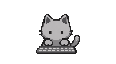
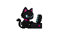
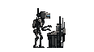
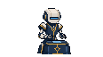

# Wayland Mascots

Mascotas animadas para compositores Wayland con layer-shell, basadas en [wayland-bongocat](https://github.com/saatvik333/wayland-bongocat). Reaccionan al teclado y permiten ajustar tamaño, posición y monitor. No necesitan los temas ni los dotfiles de Edgar.

## Mascotas incluidas

| Nombre | Diseño | Vista |
| --- | --- | --- |
| `minimal` | Gato gris |  |
| `hacker` | Gato tecnológico |  |
| `maintenance` | Robot de mantenimiento |  |
| `archivist` | Robot archivista |  |

Cada paquete tiene cinco poses SVG. La selección se incorpora al binario al compilar; cambiarla requiere recompilar.

## Dependencias

Linux, un compilador GCC compatible con C23, Make, Python 3 y las bibliotecas de desarrollo de Wayland.

```sh
# Fedora
sudo dnf install gcc make python3 wayland-devel
# Ubuntu / Debian (con GCC suficientemente reciente)
sudo apt install build-essential python3 libwayland-dev
# Arch
sudo pacman -S base-devel python wayland
```

## Compilar e instalar

```sh
git clone https://github.com/Naraku86/wayland-mascots.git
cd wayland-mascots
```

Desde la raíz del repositorio:

```sh
make mascot MASCOT=minimal
make install-user
mkdir -p ~/.config/wayland-mascots
cp mascot.conf.example ~/.config/wayland-mascots/config
~/.local/bin/wayland-mascot --config ~/.config/wayland-mascots/config --watch-config
```

La instalación usa `~/.local/bin` y no requiere sudo. Otras selecciones: `hacker`, `maintenance`, `archivist`. Para recuperar el gato original: `make embed-assets && make release`.

Para leer las teclas necesita acceso al dispositivo de entrada. `~/.local/bin/mascot-find-devices` ayuda a identificarlo. Configura `keyboard_device` si la detección automática no encuentra el correcto. El grupo `input` permite leer dispositivos de entrada, incluido el teclado: usa ese acceso solamente si aceptas concedérselo al usuario. En sistemas que utilizan ese grupo, `sudo usermod -aG input "$USER"` requiere cerrar sesión y volver a entrar.

## Posición y barra

Edita `cat_height`, `cat_align`, `cat_x_offset`, `cat_y_offset`, `overlay_height` y opcionalmente `monitor` en el archivo de configuración. Los cambios se recargan con `--watch-config`.

La mascota es una superficie independiente, no un módulo de Waybar. Su posición es fija respecto al monitor: no sigue automáticamente el ancho de los módulos de una barra dinámica. Ajusta los offsets para reservarle espacio. Añade el comando de ejecución al inicio automático de tu compositor si quieres que aparezca al iniciar sesión.

## Desarrollo

```sh
make test-mascots
make format-check
make release
make clean && make debug
make test
```

`make test` comprueba el motor; `make test-mascots` comprueba los cuatro paquetes y el generador. `make mascot` regenera `src/graphics/embedded_assets.c`; no edites ese archivo a mano. La CI también ejecuta las comprobaciones heredadas del proyecto original.

## Licencias y procedencia

El motor y nuestras modificaciones se distribuyen bajo MIT, conservando el aviso de Saatvik Sharma. NanoSVG conserva sus avisos y licencia en `lib/nanosvg.h` y `lib/nanosvgrast.h`. Consulta [ARTWORK.md](ARTWORK.md) para los gráficos.

Esta edición no incluye las mascotas de franquicias de los temas personales. Tampoco promete exclusividad de imágenes generadas con IA ni derechos sobre personajes ajenos.

La documentación completa del motor original está en [README.upstream.md](README.upstream.md). Las mejoras de estabilidad existentes en el commit de origen pertenecen al proyecto original; este fork añade paquetes de mascotas, generación de recursos sin xxd, instalación de usuario y documentación independiente.
