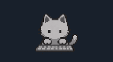
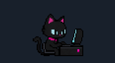
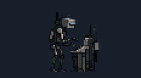
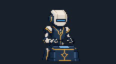

# Wayland Mascots

[Español](README.es.md)

Small keyboard-reactive mascots for Linux Wayland desktops with layer-shell. A fork of [wayland-bongocat](https://github.com/saatvik333/wayland-bongocat), with four built-in mascot packs.

| `minimal` | `hacker` | `maintenance` | `archivist` |
| --- | --- | --- | --- |
|  |  |  |  |

## Install

Requires GCC with C23 support, Make, Python 3 and Wayland development libraries. On Fedora: `sudo dnf install gcc make python3 wayland-devel`. [Other distributions](docs/CONFIGURATION.md#dependencies).

```sh
git clone https://github.com/Naraku86/wayland-mascots.git
cd wayland-mascots
make mascot MASCOT=minimal
make install-user
mkdir -p ~/.config/wayland-mascots
cp mascot.conf.example ~/.config/wayland-mascots/config
~/.local/bin/wayland-mascot --config ~/.config/wayland-mascots/config --watch-config
```

Choose a name from the table with `MASCOT=...`; switching packs requires rebuilding and reinstalling. Installation uses `~/.local/bin` without sudo. Keyboard reaction requires read access to your input device; see [permissions](docs/CONFIGURATION.md#keyboard-access).

## Configure and integrate

Edit `~/.config/wayland-mascots/config`: `cat_height` sets size, `cat_align` and offsets set position, and `monitor` selects an output. `--watch-config` reloads changes.

The mascot is a separate overlay. Reserve space beside your bar; it does not follow changing Waybar module widths. [Autostart, monitors and troubleshooting](docs/CONFIGURATION.md).

## Development and license

Run `make test-mascots` and `make test`. See [audit and validation](VALIDATION.md) and [engine architecture](ARCHITECTURE.md). GIFs demonstrate the existing poses, not a desktop recording.

MIT; upstream and NanoSVG notices retained. [Artwork provenance](ARTWORK.md) · [Original engine documentation](README.upstream.md).
